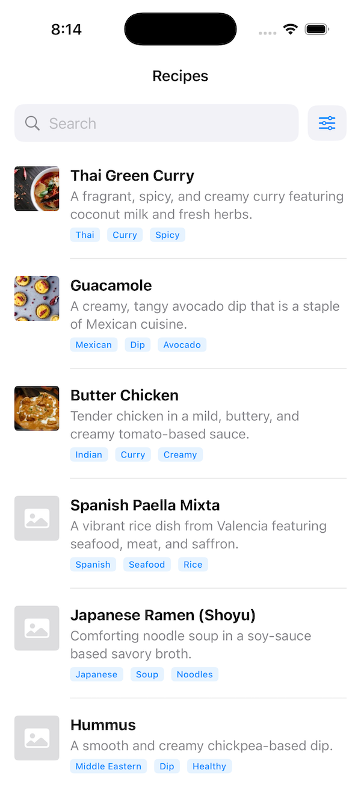
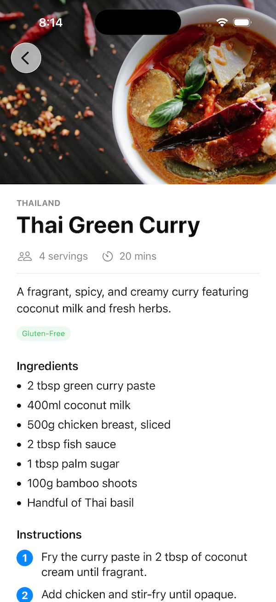

# Recipes

## Screenshots

| Main Page                     | Detail Page                        |
|:---                           |:---                                |
|  |   |

## Setup instructions

- Download a copy of this project unto your local machine 
- Extract the contents of the ZIP file
- Locate `Recipes.xcodeproj` then double click to open it
- Assuming you already have Xcode 26 installed in your computer, you should be able to compile 
this project without any issues.

## High-level architecture overview

- This project mainly uses MVVM architecture.
- MVVM promotes clear separation of concerns between the UI, business logic, and the data layer.
- Improves testability of the business logic which mostly resides in ViewModels.

## Key design decisions

- I opted for a list-style approach instead of Grid as each row provides better spacing for recipe info.
- Kept the overall design as simple as possible letting each recipe standout.
- Added image URL to the Recipe information apart from the minimum required attributes just to balance it a little bit.
- Note though that not all recipe images are correct. Some are just placeholders and the rest are even inaccessible.  

## Assumptions and tradeoffs

- App only works for a fixed number of recipes. Needs additional work to support batching and reloading. 
- Only tested on iPhone Simulator. May look vastly different on tablets in terms of the amount of spacing and layout.  

## Any known limitations

- Filter isn't completed yet. Doesn't limit filters based on the search result set as of now. 
- Recipe data used in this app is AI generated. May contain incorrect information.  
